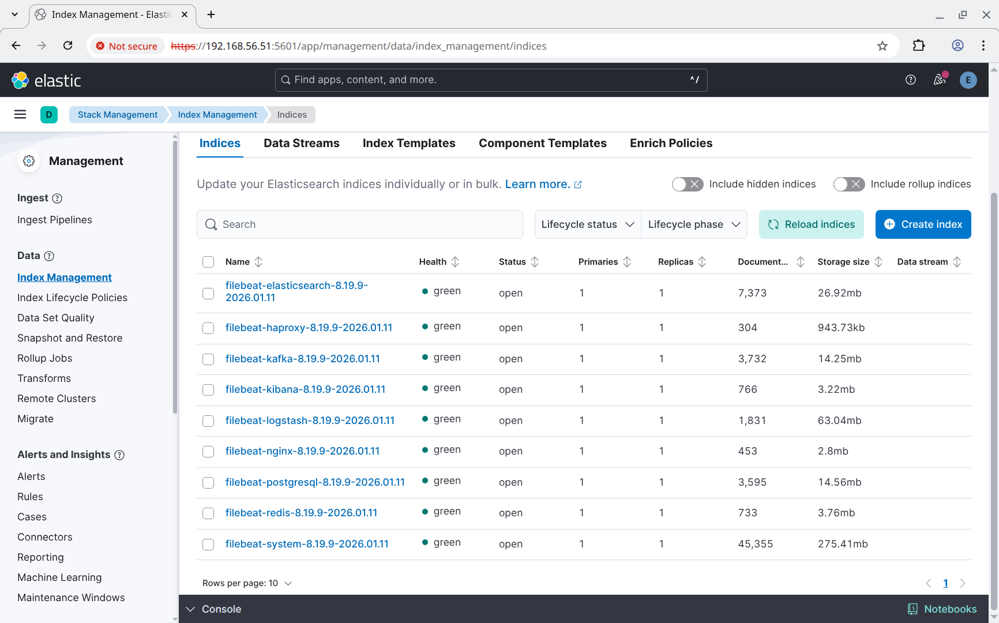
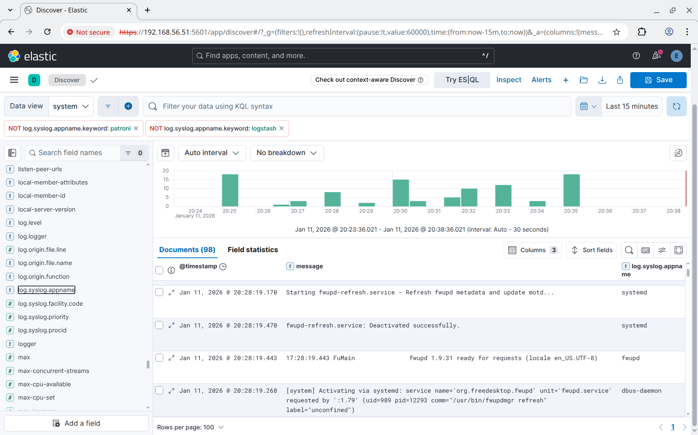

# Очередь логов: Kafka между Logstash и Elasticsearch

## Цель

Настроить сбор логов, использовать **Kafka** как промежуточную очередь между **Logstash** и **Kibana**.

## Задание

1. Развернуть **Kafka** в кластерном режиме.
2. Создать несколько топиков с несколькими партициями и репликами.
3. Установить на каждом узле агент для сбора логов.
4. Настроить отправку логов в соответствующие топики **Kafka**.
5. Развернуть кластер **ELK** (**Elasticsearch**, **Logstash**, **Kibana**).
6. Настроить **Logstash** для чтения данных из топиков **Kafka** и записи их в отдельные индексы **Elasticsearch**.
7. Создать **Data View** в **Kibana** и убедиться, что логи коректно отображаются.

## Реализация

Проект базируется на предудущем проекте [linuxhl14_elasticsearch](https://github.com/abegorov/linuxhl14_elasticsearch) (но с добавлением **Kafka**).

Задание сделано так, чтобы его можно было запустить как в **Vagrant**, так и в **Yandex Cloud**. После запуска происходит развёртывание следующих виртуальных машин:

- **kfk-backend-01** - **NetBox**, **patroni**, **redis**, **angie**;
- **kfk-backend-02** - **NetBox**, **patroni**, **redis**, **angie**;
- **kfk-backend-03** - **NetBox**, **patroni**, **redis**, **angie**;
- **kfk-es-01** - **Elasticsearch**, **kafka**;
- **kfk-es-02** - **Elasticsearch**, **kafka**;
- **kfk-es-03** - **Elasticsearch**, **kafka**.

В независимости от того, как созданы виртуальные машины, для их настройки запускается **Ansible Playbook** [provision.yml](provision.yml) который запускает следующие роли:

- **angie** - устанавливает и настраивает **angie**;
- **apt_sources** - настраивает репозитории для пакетного менеджера **apt** (используется [mirror.yandex.ru](https://mirror.yandex.ru)).
- **bach_completion** - устанавливает пакет **bash-completion**.
- **chrony** - устанавливает **chrony** для синхронизации времени между узлами.
- **elastic_repo** - настраивает репозиторий для **elasticsearch**, **kibana** и **logstash** (используется [mirror.yandex.ru/mirrors/elastic/8](https://mirror.yandex.ru/mirrors/elastic/8))/
- **elasticsearch** - устанавливает и настраивает **elasticsearch**/
- **etcd** - устанавливает и настраивает кластер **etcd** для его дальнейшего использования **patroni**.
- **filebeat** - устанавливает и настраивает **filebeat**.
- **haproxy** - устанавливает и настраивает **haproxy** для проксирования запросов к **redis** и **postgresql**.
- **hosts** - прописывает адреса всех узлов в `/etc/hosts`.
- **keepalived** - устанавливает и настраивает **keepalived** при разворачивании в **vagrant**.
- **kibana** - устанавливает и настраивает **kibana**.
- **kibana_dataview** - добавляет указанные **Data views** в индексы **kibana** в **elasticsearch**.
- **locale_gen** - генерит локаль **ru_RU.UTF-8** для последующего использования в **postgresql**.
- **logstash** - устанавливает и настраивает **logstash**.
- **netbox** - устанавливает и настраивает **netbox**.
- **patroni** - устанавливает и настраивает кластер **patroni**.
- **patroni_db** - создаёт базу данных в кластере **patroni** (определяет лидера и создаёт её на лидере).
- **patroni_facts** - собирает информацию о членах кластера **patroni** (определяет лидера).
- **patroni_privs** - настраивает права доступа к базам данных в кластере **patroni**.
- **patroni_user** - создаёт пользователей в кластере **patroni**.
- **pgbouncer** - устанавливает и настраивает **pgbouncer**.
- **pgdg_repo** - устанавливает репозиторий **pgdb** для **patroni** и **postgresql**.
- **redis** - устанавливает и настраивает **redis** (с репликацией на другие узлы).
- **redis_repo** - устанавливает и настраивает репозиторий для **redis**.
- **redis_sentinel** - устанавливает и настраивает **redis sentinel** для автоматического переключения мастера в кластере **redis**.
- **system_groups** - создаёт группы пользователей **Linux**.
- **system_users** - создаёт группы пользователей **Linux**.
- **tls_ca** - создаёт сертификаты для корневых центров сертификации.
- **tls_certs** - создаёт сертификаты для узлов.
- **tls_copy** - копирует серитификаты на узел.
- **wait_connection** - ожидает доступность виртуальных машин.

Данные роли настраиваются с помощью переменных, определённых в следующих файлах:

- [group_vars/all/angie.yml](group_vars/all/angie.yml) - общие настройки **angie**;
- [group_vars/all/ansible.yml](group_vars/all/ansible.yml) - общие переменные **ansible** для всех узлов;
- [group_vars/all/certs.yml](group_vars/all/certs.yml) - настройки генерации сертификатов для СУБД и **angie**;
- [group_vars/all/hosts.yml](group_vars/all/hosts.yml) - настройки для роли **hosts** (список узлов, которые нужно добавить в `/etc/hosts`);
- [group_vars/backend/angie.yml](group_vars/backend/angie.yml) - настройки **angie** для узлов **backend**;
- [group_vars/backend/certs.yml](group_vars/backend/certs.yml) - настройки генерации сертификатов для **backend**;
- [group_vars/backend/filebeat.yml](group_vars/backend/filebeat.yml) - настройки для **filebeat** для **backend**;
- [group_vars/backend/haproxy.yml](group_vars/backend/haproxy.yml) - настройки **haproxy**  для узлов **backend** (проксирования не лидера **patroni** и **redis**);
- [group_vars/backend/keepalived.yml](group_vars/backend/keepalived.yml) - настройки **keepalived** для узлов **backend**;
- [group_vars/backend/netbox.yml](group_vars/backend/netbox.yml) - настройки **netbox** для узлов **backend**;
- [group_vars/backend/patroni.yml](group_vars/backend/patroni.yml) - настройки **patroni** для узлов **backend**;
- [group_vars/backend/pgbouncer.yml](group_vars/backend/pgbouncer.yml) - настройки **pgbouncer** для узлов **backend**;
- [group_vars/backend/redis.yml](group_vars/backend/redis.yml) - настройки **redis** для узлов **backend**;
- [group_vars/backend/users.yml](group_vars/backend/users.yml) - настройки создания пользователей и групп на узлах **backend**;
- [group_vars/elasticsearch/certs.yml](group_vars/elasticsearch/certs.yml) - настройки генерации сертификатов для **elasticsearch**;
- [group_vars/elasticsearch/elasticsearch.yml](group_vars/elasticsearch/elasticsearch.yml) - настройки для **elasticsearch**;
- [group_vars/elasticsearch/filebeat.yml](group_vars/elasticsearch/filebeat.yml) - настройки для **filebeat** для **elasticsearch**;
- [group_vars/elasticsearch/kibana.yml](group_vars/elasticsearch/kibana.yml) - настройки для **kibana** для **elasticsearch**;
- [group_vars/elasticsearch/logstash.yml](group_vars/elasticsearch/logstash.yml) - настройки для **logstash** для **elasticsearch**;
- [host_vars/kfk-backend-01/redis.yml](host_vars/kfk-backend-01/redis.yml) - настройки **redis** для **kfk-backend-01**;
- [host_vars/kfk-backend-01/keepalived.yml](host_vars/kfk-backend-01/keepalived.yml) - настройки **keepalived** для **kfk-backend-01**;
- [host_vars/kfk-backend-02/keepalived.yml](host_vars/kfk-backend-02/keepalived.yml) - настройки **keepalived** для **kfk-backend-02**;
- [host_vars/kfk-backend-03/keepalived.yml](host_vars/kfk-backend-03/keepalived.yml) - настройки **keepalived** для **kfk-backend-03**;
- [host_vars/kfk-es-01/elasticsearch.yml](host_vars/kfk-es-01/elasticsearch.yml) - настройки **elasticsearch** для **kfk-backend-01** (позволяет установить пароль кластера только на этом узле).

## Запуск

### Запуск в Yandex Cloud

1. Необходимо установить и настроить утилиту **yc** по инструкции [Начало работы с интерфейсом командной строки](https://yandex.cloud/ru/docs/cli/quickstart).
2. Необходимо установить **Terraform** по инструкции [Начало работы с Terraform](https://yandex.cloud/ru/docs/tutorials/infrastructure-management/terraform-quickstart).
3. Необходимо установить **Ansible**.
4. Необходимо перейти в папку проекта и запустить скрипт [up.sh](up.sh).

### Запуск в Vagrant (VirtualBox)

Необходимо скачать **VagrantBox** для **bento/ubuntu-24.04** версии **202510.26.0** и добавить его в **Vagrant** под именем **bento/ubuntu-24.04/202510.26.0**. Сделать это можно командами:

```shell
curl -OL https://app.vagrantup.com/bento/boxes/ubuntu-24.04/versions/202510.26.0/providers/virtualbox/amd64/vagrant.box
vagrant box add vagrant.box --name "bento/ubuntu-24.04/202510.26.0"
rm vagrant.box
```

После этого нужно сделать **vagrant up** в папке проекта.

## Проверка

Протестировано в **OpenSUSE Tumbleweed**:

- **Vagrant 2.4.9**
- **VirtualBox 7.2.4_SUSE r170995**
- **Ansible 2.20.1**
- **Python 3.13.9**
- **Jinja2 3.1.6**
- **Terraform 1.14.3**

После запуска **NetBox** должен открываться по **IP** балансировщика. Для **Yandex Cloud** адрес можно узнать в выводе **terraform output** в поле **load_balancer** (смотри [outputs.tf](outputs.tf)). Для **vagrant** это (можно использовать любой адрес):

- [https://192.168.56.51](https://192.168.56.51) - узел **kfk-backend-01**.
- [https://192.168.56.52](https://192.168.56.52) - узел **kfk-backend-02**.
- [https://192.168.56.53](https://192.168.56.53) - узел **kfk-backend-03**.

Однако **keepalived** настроен таким образом, что при недоступности одного из узлов, его адрес переезжает на один из доступных.

Для начала проверим, что **kibana** и **backend** поднялись для этого перейдём на порты **443**, **5601** и **9443** балансировщика.


Конвейер сбора логов представляет из себя **Filebeat** -> **Logstash** -> **ElasticSearch**. Каждое приложение пришет в свой индекс, поэтому если индексы были созданы, то настройка прошла успешно. Зайдём в **Kibana** -> **Stack Management** -> **Data** -> **index Management** (пароль пользователя **elastic** генерится автоматически и доступен в файл [secrets/elasticsearch_elastic_password.txt](secrets/elasticsearch_elastic_password.txt)) и проверим, что все индексы были созданы. Видно, что создалось 8 индексов, все в статусе **green** и у каждого есть одна реплика:



Посмотрим содержимое этих индексов через **Kibana** -> **Analytics** -> **Discover**:



